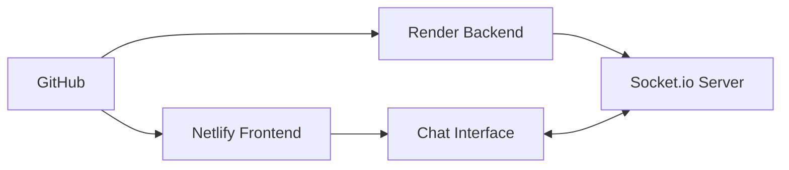

# 🚀 Guia Completo - Deploy no Netlify

## ✅ **O que você precisa fazer**

### **1. Deploy do Backend (Render.com)**
Primeiro, você precisa hospedar o servidor Node.js:

1. **Acesse**: https://render.com
2. **Conecte sua conta GitHub**
3. **Crie um Web Service**:
   - Repositório: `Thucosta0/FalaAlunos`
   - Runtime: `Node`
   - Build Command: `npm install`
   - Start Command: `npm start`
4. **Aguarde o deploy** - URL será algo como: `https://fala-alunos-server.onrender.com`

### **2. Deploy do Frontend (Netlify)**

#### **Método 1: Deploy Automático**
[](https://app.netlify.com/start/deploy?repository=https://github.com/Thucosta0/FalaAlunos)

#### **Método 2: Manual**
1. **Acesse**: https://app.netlify.com
2. **Clique**: "New site from Git"
3. **Conecte GitHub** e selecione `FalaAlunos`
4. **Configurações de Build**:
   ```
   Branch: main
   Base directory: (deixar vazio)
   Build command: (deixar vazio)  
   Publish directory: .
   ```
5. **Deploy**: Clique em "Deploy site"

---

## 🔧 **Configurações Incluídas**

✅ **`netlify.toml`** - Configuração principal  
✅ **`_redirects`** - Roteamento SPA  
✅ **Auto-detecção** - Chat detecta Netlify automaticamente  
✅ **Headers de segurança** - Configurados automaticamente  
✅ **Cache otimizado** - Para JS e CSS  

---

## 🔗 **URLs Finais**

Após o deploy, você terá:

### **Frontend (Netlify)**
- URL: `https://[nome-do-site].netlify.app`
- Exemplo: `https://fala-alunos.netlify.app`

### **Backend (Render)**
- URL: `https://fala-alunos-server.onrender.com`
- API Status: `https://fala-alunos-server.onrender.com/api/status`

---

## 🧪 **Como Testar**

### **1. Testar Backend**
Acesse: `https://fala-alunos-server.onrender.com/api/status`

Deve retornar:
```json
{
  "status": "online",
  "activeUsers": {
    "admins": 0,
    "students": 0
  },
  "totalMessages": 0,
  "uptime": 123.45
}
```

### **2. Testar Frontend**
1. Acesse seu site no Netlify
2. Escolha "Sou Aluno" 
3. Abra outra aba
4. Escolha "Sou Administrativo" (admin/123)
5. Teste o chat entre as abas

---

## 🎯 **Fluxo Completo**



1. **Código no GitHub** 📁
2. **Frontend no Netlify** 🌐  
3. **Backend no Render** ⚡
4. **Chat funcionando** 💬

---

## 🐛 **Problemas Comuns**

### **❌ Chat não conecta**
- Verifique se o backend Render está online
- Abra o console do browser (F12) e procure erros
- Confirme a URL do servidor: `https://fala-alunos-server.onrender.com`

### **❌ Erro 404 nas páginas**
- Verifique se o arquivo `_redirects` foi commitado
- Force um novo deploy no Netlify

### **❌ CORS Error**
- O servidor já está configurado com CORS
- Se persistir, verifique se o backend está rodando

---

## 🎉 **Sucesso!**

Quando tudo estiver funcionando:

✅ Frontend no Netlify  
✅ Backend no Render  
✅ Chat em tempo real  
✅ Login administrativo  
✅ Interface responsiva  

**Seu sistema estará 100% funcional na nuvem!** 🚀

---

## 📞 **Suporte**

Se encontrar problemas:

1. **Console do Browser** (F12) - Verificar erros JavaScript
2. **Netlify Deploy Logs** - Verificar erros de build
3. **Render Logs** - Verificar erros do servidor
4. **Network Tab** - Verificar conexões de API

**Happy coding!** 🎊 